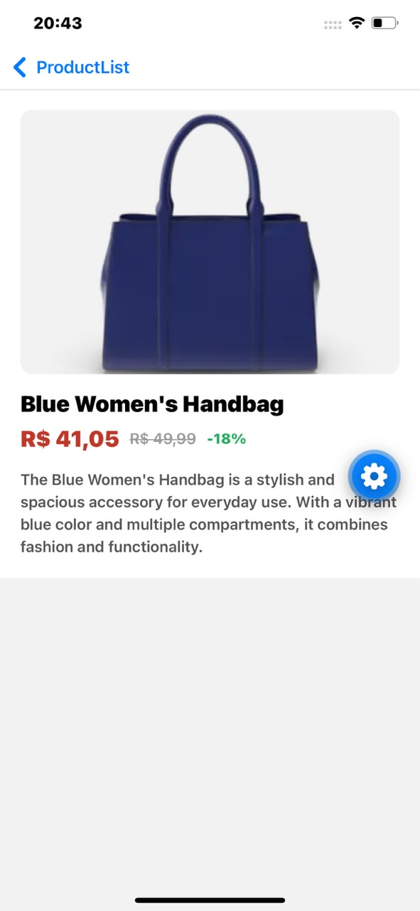

# Catálogo Interativo Mobile

Aplicativo mobile feito em React Native com Expo para a disciplina Mobile Development (UniFECAF). Consome a API pública [DummyJSON](https://dummyjson.com/docs) para listar produtos por categoria, mostrar detalhes de cada item e simular login/logout.

**Aluno:** Mikael Icaro Simões
**RA:** 96278

## Funcionalidades

- Login com validação de campos (usuário e senha obrigatórios, feedback de erro por campo e mensagem de credenciais inválidas)
- Listagem de produtos separada por abas — Masculino e Feminino — consumindo a API via Axios
- Tela de detalhes com nome, descrição, imagem, preço e desconto
- Logout, que limpa os dados da sessão e volta para o login

Por definição do enunciado, não há cadastro, edição ou exclusão de produtos — só consumo/leitura da API.

## Tecnologias

- React Native + Expo
- React Navigation (native stack)
- Axios
- Redux Toolkit (estado de sessão do usuário)

## Como rodar

Pré-requisitos: Node.js instalado e o app **Expo Go** no celular (disponível na Play Store/App Store).

```bash
npm install
npx expo start
```

O terminal vai mostrar um QR code. Abra o Expo Go e escaneie — celular e computador precisam estar na mesma rede Wi-Fi.

> A partir do SDK 57, o Expo Go exige estar logado com a mesma conta no terminal (`npx expo login`) e no app. É rápido e gratuito, só na primeira vez.

## Estrutura do projeto

```
src/
  components/   componentes reutilizáveis (ex: card de produto)
  navigation/   configuração de navegação entre telas
  screens/      telas do app (login, listagem, detalhes)
  services/     chamadas à API e formatação de preço
  store/        Redux Toolkit (slice de autenticação)
```

## Categorias consultadas

- Masculino: `mens-shirts`, `mens-shoes`, `mens-watches`
- Feminino: `womens-bags`, `womens-dresses`, `womens-jewellery`, `womens-shoes`, `womens-watches`

## Capturas de tela

| Login | Lista (Masculino) | Detalhe |
|---|---|---|
|  |  |  |

| Lista (Feminino) | Detalhe |
|---|---|
|  |  |
