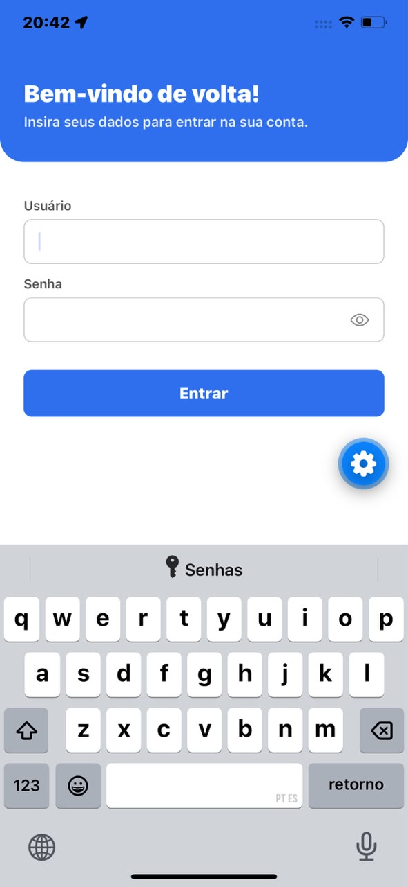
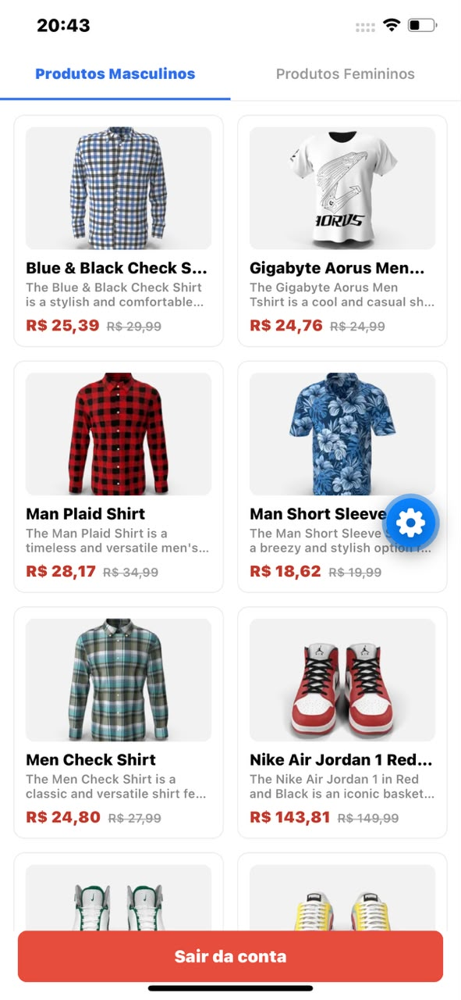
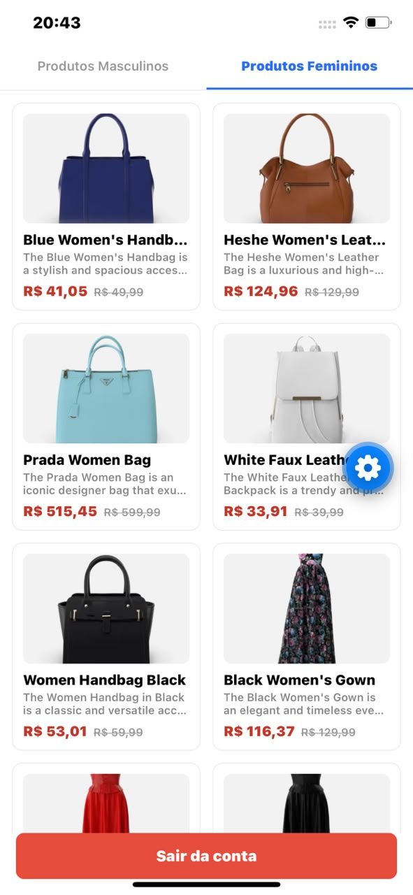
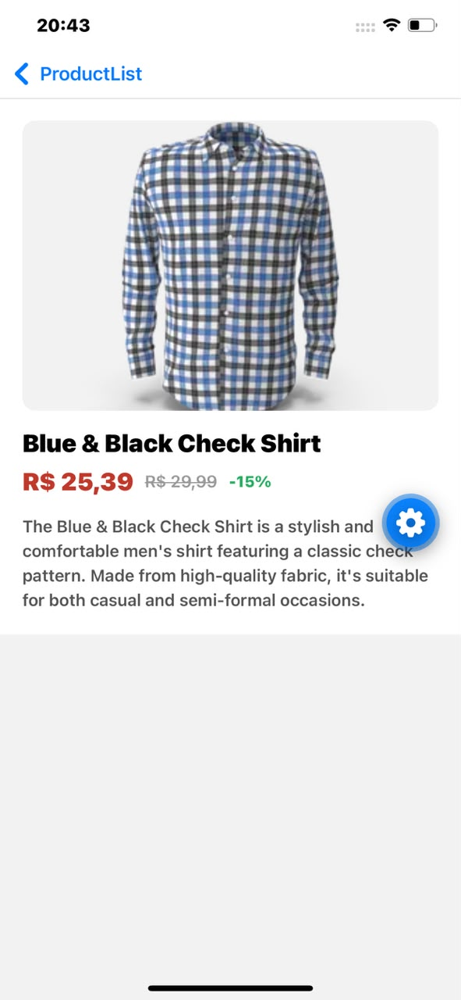

# Catálogo Interativo Mobile — Capturas de Tela

**Aluno:** Mikael Icaro Simões — **RA:** 96278
**Disciplina:** Mobile Development — UniFECAF

| Login | Lista — Masculino |
|---|---|
| {width=45%} | {width=45%} |

| Lista — Feminino | Detalhe do produto |
|---|---|
| {width=45%} | {width=45%} |

## Funcionalidades demonstradas

- **Login**: valida usuário e senha antes de liberar o acesso. Campo vazio mostra "Campo obrigatório"; credenciais muito curtas mostram "Usuário ou senha inválidos". O usuário logado fica guardado no Redux (Redux Toolkit) até o logout.
- **Listagem por categoria**: abas Masculino/Feminino buscam os produtos via Axios na API DummyJSON (`mens-shirts`, `mens-shoes`, `mens-watches` / `womens-bags`, `womens-dresses`, `womens-jewellery`, `womens-shoes`, `womens-watches`). Preço com desconto em destaque, valor original riscado.
- **Detalhe do produto**: ao tocar em um item, o app busca o produto pelo ID (`/products/{id}`) e mostra imagem, nome, descrição, preço e percentual de desconto.
- **Logout**: botão "Sair da conta" fixo no rodapé da listagem, limpa a sessão e volta para o login.
